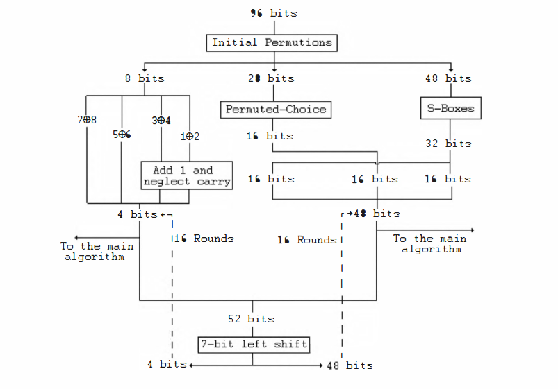

# DES96 - Improved DES Security

1. [Link](https://ieeexplore.ieee.org/stamp/stamp.jsp?arnumber=5585593) to the paper. 

2. Block Diagram of DES96: 

### What have we implemented? 

1. The Classic DES Algorithm. 
2. The new DES96 algorithm proposed in the above mentioned paper. 
3. The triple DES Algorithm. 

### Tests we have done: 

1. **Randomness Test** : This simplified test is performed by calculating the numbers of zeros and ones in the ciphertext resulting from the DES96 encryption and the results are compared to those of the plaintext. 

* [Link to randomness test output](./randomtest.output)

2. **Entropy Test** : Entropy test is the measure of Randomness of a give piece of Data. We calculated Entropy of plaintext and the ciphertext and compared the results. 

* [Link to entropy test output](./entropytest.output)

3. **Avalanche Test for changing plaintext bits**: One, two and three bits of plaintext are changed and Hamming Distance of the 3 ciphertexts are compared. 

4. **Avalanche Test for changing key bits**: One, two and three bits of the key is changed and Hamming Distance of the 3 ciphertexts are compared. 

* [Link to avalanche test output](./avalanchetest.output)

